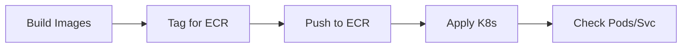
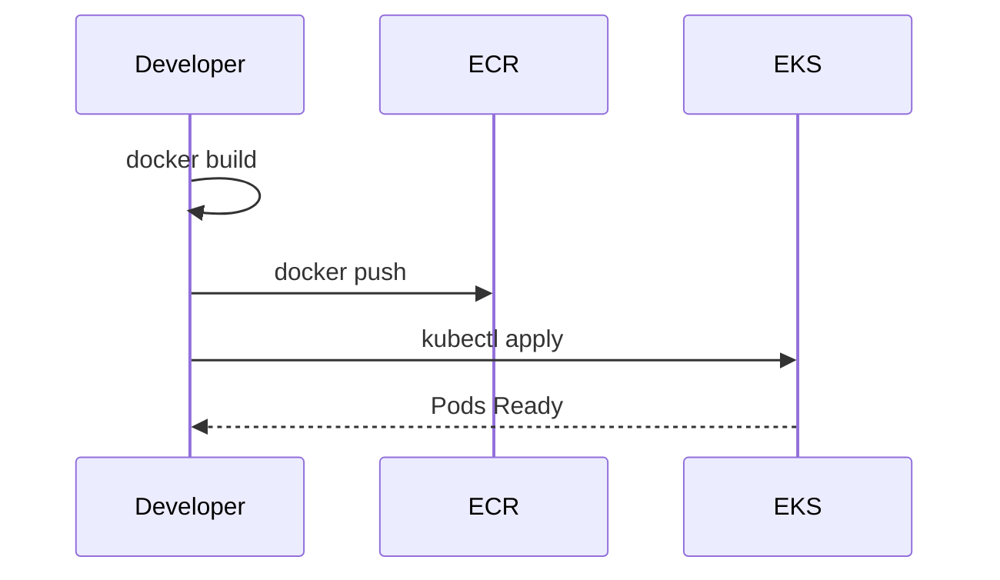

# EKS 배포 가이드 (ex04-kind 코드 사용, 주의사항 포함)

이 가이드는 `ex04-kind` 코드를 그대로 사용하면서, 배포 환경만 **Kind -> EKS**로 전환할 때 필요한 절차와 주의점을 정리한 문서입니다.

## 0. 전제

- **코드는 `ex04-kind`를 그대로 사용**합니다.
- 배포 YAML은 `ex04-kind/k8s`를 기준으로 합니다.
- EKS에서는 **이미지 로드(Kind load)** 대신 **이미지 레지스트리(ECR 등) 푸시**가 필요합니다.

## 1. 사전 준비 (EKS)

필요 도구:
- AWS CLI
- kubectl
- eksctl
- (권장) Helm

### 1.1. AWS CLI 인증

```bash
aws configure
aws sts get-caller-identity
```

### 1.2. EKS 클러스터 생성 (예시)

```bash
eksctl create cluster \
  --name msa-eks \
  --region ap-northeast-2 \
  --nodes 2 \
  --node-type t3.medium
```

> 이미 클러스터가 있다면 생성 단계는 건너뛰세요.

### 1.3. kubeconfig 연결

```bash
aws eks update-kubeconfig --region ap-northeast-2 --name msa-eks
kubectl get nodes
```

## 2. 네임스페이스 생성

```bash
kubectl create namespace metacoding
```

## 3. 이미지 빌드 후 ECR에 푸시

Kind와 다르게 **EKS는 로컬 이미지를 직접 볼 수 없습니다.** 반드시 레지스트리에 올려야 합니다.

### 3.1. ECR 리포지토리 준비 (예시)

```bash
aws ecr create-repository --repository-name metacoding/db
aws ecr create-repository --repository-name metacoding/gateway
aws ecr create-repository --repository-name metacoding/order
aws ecr create-repository --repository-name metacoding/product
aws ecr create-repository --repository-name metacoding/user
aws ecr create-repository --repository-name metacoding/delivery
aws ecr create-repository --repository-name metacoding/orchestrator
aws ecr create-repository --repository-name metacoding/frontend
```

### 3.2. 로그인

```bash
aws ecr get-login-password --region ap-northeast-2 | \
  docker login --username AWS --password-stdin <ACCOUNT_ID>.dkr.ecr.ap-northeast-2.amazonaws.com
```

### 3.3. 이미지 빌드 + 태그 + 푸시

```bash
# 빌드
docker build -t metacoding/db:1 ./db
docker build -t metacoding/gateway:1 ./api-gateway
docker build -t metacoding/order:1 ./order
docker build -t metacoding/product:1 ./product
docker build -t metacoding/user:1 ./user
docker build -t metacoding/delivery:1 ./delivery
docker build -t metacoding/orchestrator:1 ./orchestrator
docker build -t metacoding/frontend:1 ./frontend

# 태그
docker tag metacoding/db:1 <ACCOUNT_ID>.dkr.ecr.ap-northeast-2.amazonaws.com/metacoding/db:1
docker tag metacoding/gateway:1 <ACCOUNT_ID>.dkr.ecr.ap-northeast-2.amazonaws.com/metacoding/gateway:1
docker tag metacoding/order:1 <ACCOUNT_ID>.dkr.ecr.ap-northeast-2.amazonaws.com/metacoding/order:1
docker tag metacoding/product:1 <ACCOUNT_ID>.dkr.ecr.ap-northeast-2.amazonaws.com/metacoding/product:1
docker tag metacoding/user:1 <ACCOUNT_ID>.dkr.ecr.ap-northeast-2.amazonaws.com/metacoding/user:1
docker tag metacoding/delivery:1 <ACCOUNT_ID>.dkr.ecr.ap-northeast-2.amazonaws.com/metacoding/delivery:1
docker tag metacoding/orchestrator:1 <ACCOUNT_ID>.dkr.ecr.ap-northeast-2.amazonaws.com/metacoding/orchestrator:1
docker tag metacoding/frontend:1 <ACCOUNT_ID>.dkr.ecr.ap-northeast-2.amazonaws.com/metacoding/frontend:1

# 푸시
docker push <ACCOUNT_ID>.dkr.ecr.ap-northeast-2.amazonaws.com/metacoding/db:1
docker push <ACCOUNT_ID>.dkr.ecr.ap-northeast-2.amazonaws.com/metacoding/gateway:1
docker push <ACCOUNT_ID>.dkr.ecr.ap-northeast-2.amazonaws.com/metacoding/order:1
docker push <ACCOUNT_ID>.dkr.ecr.ap-northeast-2.amazonaws.com/metacoding/product:1
docker push <ACCOUNT_ID>.dkr.ecr.ap-northeast-2.amazonaws.com/metacoding/user:1
docker push <ACCOUNT_ID>.dkr.ecr.ap-northeast-2.amazonaws.com/metacoding/delivery:1
docker push <ACCOUNT_ID>.dkr.ecr.ap-northeast-2.amazonaws.com/metacoding/orchestrator:1
docker push <ACCOUNT_ID>.dkr.ecr.ap-northeast-2.amazonaws.com/metacoding/frontend:1
```

## 4. Kubernetes 매니페스트 수정 (중요)

`ex04-kind/k8s` 안의 모든 Deployment YAML에서 이미지 주소를 **ECR 경로로 변경**하세요.

예시:
```yaml
image: metacoding/gateway:1
```

변경:
```yaml
image: <ACCOUNT_ID>.dkr.ecr.ap-northeast-2.amazonaws.com/metacoding/gateway:1
```

## 5. 배포 순서

```bash
kubectl apply -f ex04-kind/k8s/kafka -n metacoding
kubectl wait --for=condition=ready pod -l app=kafka -n metacoding --timeout=300s

kubectl apply -f ex04-kind/k8s/db -n metacoding
kubectl apply -f ex04-kind/k8s/gateway -n metacoding
kubectl apply -f ex04-kind/k8s/order -n metacoding
kubectl apply -f ex04-kind/k8s/product -n metacoding
kubectl apply -f ex04-kind/k8s/user -n metacoding
kubectl apply -f ex04-kind/k8s/delivery -n metacoding
kubectl apply -f ex04-kind/k8s/orchestrator -n metacoding
kubectl apply -f ex04-kind/k8s/frontend -n metacoding
```

## 6. 외부 접근 (EKS)

Kind와 다르게 **EKS는 기본적으로 외부 노출이 없습니다.**
서비스 접근을 위해 아래 중 하나를 선택해야 합니다:

1. **Service Type LoadBalancer**
- Frontend, Gateway 서비스에 `type: LoadBalancer` 설정
- AWS가 ELB를 자동 생성

2. **Ingress Controller 사용** (권장)
- AWS Load Balancer Controller 설치
- Ingress 리소스 추가

간단한 테스트는 포트포워딩도 가능:
```bash
kubectl port-forward service/frontend-service -n metacoding 3000:80
```

## 7. 상태 확인

```bash
kubectl get pods -n metacoding
kubectl get svc -n metacoding
```

## 8. Kind -> EKS 전환 시 주의사항 (핵심)

1. **이미지 로드 방식 차이**
- Kind: `kind load docker-image`로 로컬 이미지를 주입
- EKS: 반드시 레지스트리(ECR, Docker Hub 등)에 푸시

2. **이미지 경로 수정 필수**
- `metacoding/service:1` -> `ACCOUNT_ID.dkr.ecr.../metacoding/service:1`
- 수정하지 않으면 `ImagePullBackOff` 발생

3. **네트워크/접근 방식 차이**
- Kind는 포트포워드로 손쉽게 접근 가능
- EKS는 LoadBalancer/Ingress 설정 필요

4. **스토리지**
- DB/Kafka 같은 상태 저장 서비스는 **EBS 볼륨**이 필요함
- StorageClass, PVC가 EKS 환경에 맞게 동작하는지 확인

5. **리소스 제한**
- EKS 노드는 스펙이 제한적일 수 있음 (t3.medium 기준)
- Kafka/DB가 뜨지 않으면 노드 타입 업그레이드 고려

6. **보안 그룹/서브넷**
- LoadBalancer가 생성되어도 보안 그룹 규칙 때문에 외부 접속이 막힐 수 있음
- 포트 오픈 여부 확인 필요

7. **비용**
- EKS는 클러스터 비용 + 노드 비용 + ELB/EBS 비용 발생
- 실습 후 리소스 정리 필요

## 9. 정리 (리소스 삭제)

```bash
kubectl delete namespace metacoding
```

클러스터 자체 삭제:
```bash
eksctl delete cluster --name msa-eks --region ap-northeast-2
```

## Mermaid 다이어그램

### Flow



### Sequence



