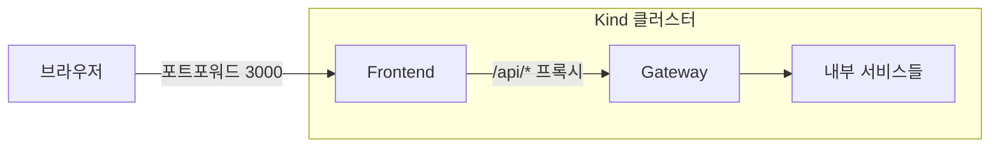
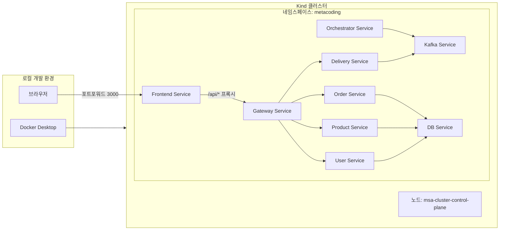
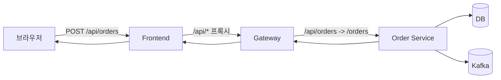
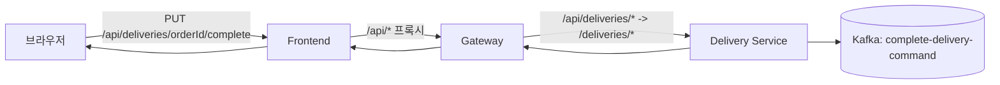
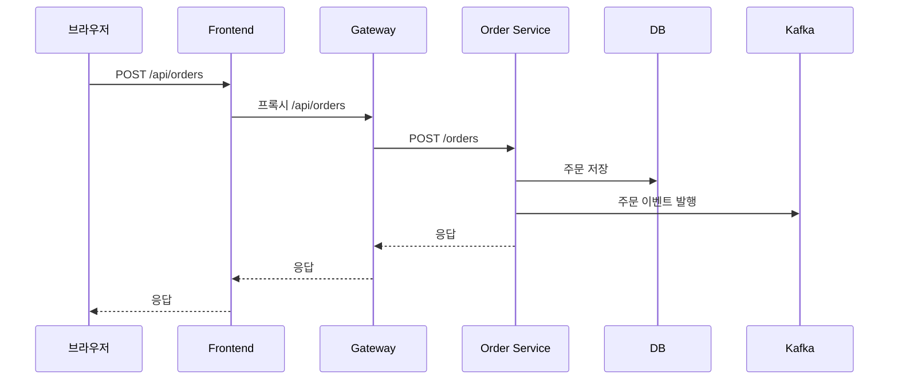
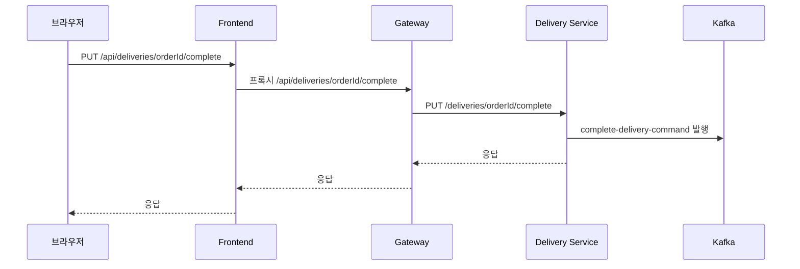
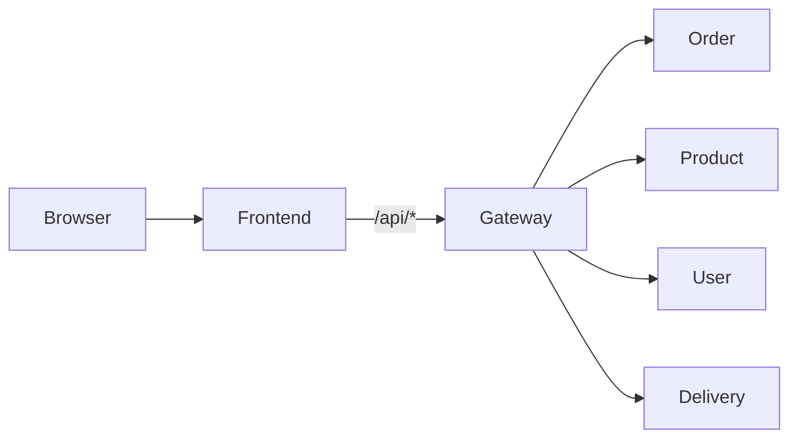
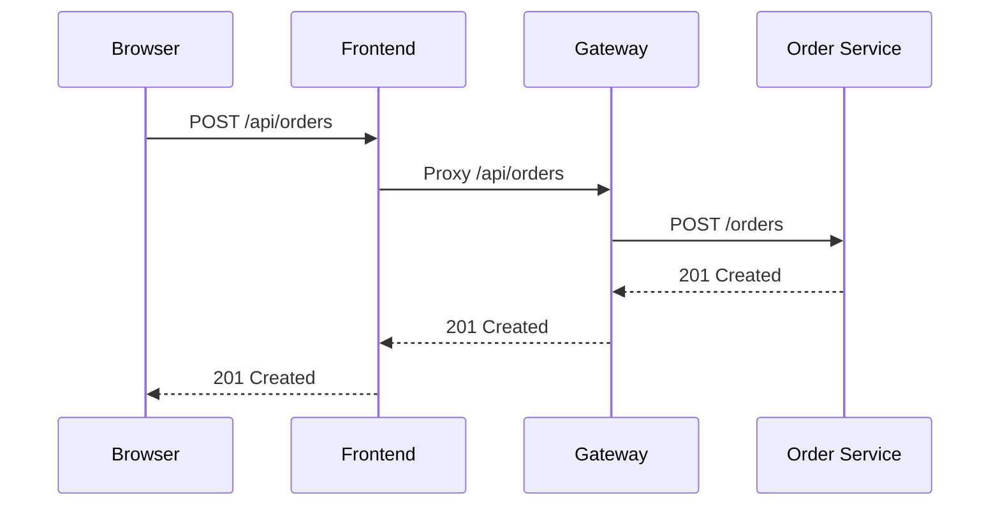

# 프론트 -> 게이트웨이 라우팅 설명

프론트엔드는 모든 백엔드 요청을 **게이트웨이로만** 보내고, 게이트웨이가 내부 서비스로 라우팅합니다.  
즉, **프론트는 여러 마이크로서비스의 주소를 몰라도** 되고, 게이트웨이가 단일 진입점 역할을 합니다.

## 구성도 (Mermaid, LR)

### 요약 구성도



### 상세 구성도



## 왜 필요한가?

1. **단일 진입점 (Single Entry Point)**
   - 프론트는 `gateway` 주소만 알면 됩니다.
   - 서비스가 늘어나도 프론트 코드는 거의 바뀌지 않습니다.

2. **보안/인증 처리의 중앙화**
   - JWT 검사, 사용자 식별 등을 게이트웨이에서 한 번만 처리합니다.
   - 각 서비스에 인증 로직을 중복으로 넣지 않아도 됩니다.

3. **라우팅 규칙의 일관성**
   - `/api/orders`, `/api/users`, `/api/deliveries` 같은 규칙을 게이트웨이에서 관리합니다.
   - 프론트는 규칙에 맞춰 호출만 하면 됩니다.

4. **운영 편의성**
   - 서비스의 실제 주소가 바뀌어도 게이트웨이 설정만 바꾸면 됩니다.
   - 로깅/모니터링 포인트를 한 곳에 모을 수 있습니다.

## 이 프로젝트에서의 실제 흐름

- **브라우저** → `frontend-service`
- **프론트(Nginx)** → `gateway-service`로 `/api/*` 요청 프록시
- **게이트웨이** → 각 마이크로서비스로 라우팅

예시:
```
브라우저 -> Frontend(/api/orders) -> Gateway(/api/orders) -> Order Service(/orders)
```

## 관련 설정 위치

- 프론트 프록시: `frontend/nginx.conf`
- 게이트웨이 라우팅: `api-gateway/src/main/java/com/metacoding/gateway/controller/GatewayController.java`

## 예시 흐름 (Mermaid, LR)

### 주문 생성 흐름 (Order)



### 배달 완료 흐름 (Delivery Complete)



## 시퀀스 다이어그램 (Mermaid)

### 주문 생성 시퀀스



### 배달 완료 시퀀스



## Mermaid 다이어그램

### Flow



### Sequence



