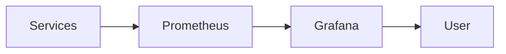
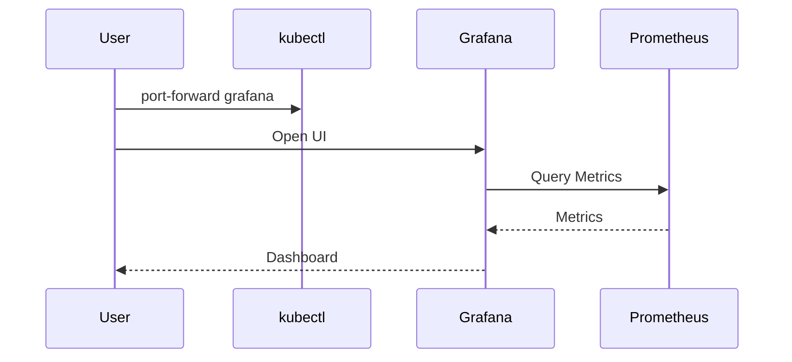

# 📊 MSA 모니터링 실전 가이드 (EKS)

이 문서는 Prometheus와 Grafana를 사용하여 우리가 구축한 MSA 시스템의 상태를 **눈으로 확인하고 추적하는 방법**을 설명합니다. 단순히 "서버가 켜져 있나?"를 넘어, **로그인하고 주문할 때 내부에서 무슨 일이 어나는지** 그래프로 확인해봅시다.

---

## 1. 모니터링 접속 준비

모니터링 도구는 보안상 외부(인터넷)에 노출하지 않고, 로컬에서 **포트 포워딩(Port Forwarding)**을 통해 안전하게 접속합니다.

### 1-1. 포트 포워딩 실행
터미널을 열고 다음 명령어를 실행하여 내 컴퓨터와 EKS 클러스터를 연결합니다. (실습하는 동안 터미널을 켜두세요)

```powershell
# Grafana 접속 터널 열기 (3000번 포트)
kubectl port-forward svc/grafana -n monitoring 3000:3000
```

### 1-2. Grafana 로그인
1. 웹 브라우저 접속: [http://localhost:3000](http://localhost:3000)
2. 로그인 정보:
   - **ID**: `admin`
   - **PW**: `admin` (첫 로그인 시 비밀번호 변경 요청이 뜨면 `Skip` 하셔도 됩니다)

### 1-3. 데이터소스 확인
1. 왼쪽 메뉴 **Connections** (플러그 아이콘) -> **Data sources** 클릭.
2. `Prometheus`가 이미 등록되어 있어야 합니다. (우리가 ConfigMap으로 자동 등록해둠)
3. 클릭해서 맨 아래 **Test** 버튼을 눌러 `Successfully queried...` 초록색 메시지가 뜨면 준비 완료!

---

## 2. 필수 관제 대시보드 만들기 (실습)

이미 만들어진 복잡한 대시보드보다, 우리가 보고 싶은 핵심 지표 3가지만 딱 골라서 만들겠습니다. 따라 해보세요!

**패널 생성 방법**:
1. 왼쪽 메뉴 **Dashboards** (네모 아이콘) -> **New** -> **New Dashboard**.
2. **+ Add visualization** 클릭.
3. `Prometheus` 선택.

### 📈 패널 1: "주문이 들어오고 있나?" (HTTP 요청 수)
사용자가 주문 버튼을 누를 때마다 그래프가 튀는지 확인합니다.

1. **Metrics browser** 입력창에 다음 쿼리 입력:
   ```promql
   # 1분당 HTTP 요청 수의 변화율 (rate)
   rate(http_server_requests_seconds_count{uri="/api/orders", method="POST"}[1m]) * 60
   ```
2. **Run queries** 클릭.
3. 오른쪽 옵션 패널:
   - **Title**: `주문 요청량 (분당)`
   - **Graph styles**: `Bar` (막대 그래프 추천)
4. **Apply** 클릭.

### 📈 패널 2: "메시지가 큐에 쌓이나?" (Kafka 적체량)
주문 서비스가 제때 처리하지 못하고 큐에 메시지가 쌓이는지 감시합니다. `Lag(지연)`은 가장 중요한 지표입니다.

1. **Metrics browser** 입력창에 다음 쿼리 입력:
   ```promql
   # 현재 컨슈머 그룹(주문 처리반)의 처리 지연 개수
   kafka_consumergroup_lag{topic="order-created"}
   ```
   > *참고: Kafka Exporter가 설치되어 있어야 정확히 보입니다. 만약 안 보인다면 아래의 'JVM 메모리'로 대체하세요.*
   
   **(대체) JVM 메모리 사용량**:
   ```promql
   # 각 서비스별 힙 메모리 사용량
   sum(jvm_memory_used_bytes{area="heap"}) by (application)
   ```

### 📈 패널 3: "서버가 힘든가?" (CPU 사용량)
특정 서비스가 CPU를 많이 먹고 있지 않은지 확인합니다.

1. **Metrics browser** 입력창에 다음 쿼리 입력:
   ```promql
   # 각 컨테이너의 CPU 사용량 (코어 단위)
   rate(container_cpu_usage_seconds_total{namespace="metacoding", image!=""}[1m])
   ```

2. 오른쪽 **Legend** (범례) 설정: `{{pod}}` 입력 (그래프 선이 어떤 파드인지 이름 표시).
3. **Apply** 클릭.

---

## 3. 시나리오별 모니터링 실습 가이드

이제 창을 두 개 띄우고 테스트를 시작합니다.
*   **창 1**: 우리 웹 사이트 (주문 화면)
*   **창 2**: 방금 만든 Grafana 대시보드 (우측 상단 `Refresh` 간격을 `5s`로 설정)

### ✅ 시나리오 1: 로그인 부하 테스트
**목표**: User 서비스가 일을 하는지 그래프로 확인하기.

1. 웹에서 로그인을 **빠르게 5번 연속**으로 시도해보세요.
2. Grafana의 **HTTP 요청 그래프(패널1)**에서 `/login` (쿼리 변경 필요) 혹은 전체 트래픽이 `툭 튀어오르는지` 확인합니다.
3. **CPU 그래프(패널3)**에서 `user-service-xxx` 파드의 선이 살짝 올라가는지 확인합니다.
   - *"아, 내가 로그인 버튼을 누르면 이 파드가 일을 하는구나!"*

### ✅ 시나리오 2: 주문 폭주와 Kafka 흐름
**목표**: 주문 -> Kafka -> 배달 서비스로 이어지는 흐름 보기.

1. 웹에서 **[주문 요청하기]** 버튼을 누릅니다.
2. **HTTP 패널**: `/api/orders` 요청 막대그래프가 하나 솟습니다. (주문 접수)
3. **메모리/CPU 패널**:
   - 처음엔 `order-service`가 움직입니다. (주문 저장)
   - 1~2초 뒤 `delivery-service`가 움직입니다. (Kafka 메시지 수신 후 배달 생성)
   - *"두 서비스가 시차를 두고 반응하는 것"*이 바로 **비동기 처리(Kafka)**의 증거입니다!

### ✅ 시나리오 3: 배달 완료
1. 포스트맨으로 배달 완료 요청을 보냅니다.
2. **CPU 패널**에서 `orchestrator-service`가 갑자기 튀어오르는지 봅니다.
   - 오케스트레이터가 "배달 끝났으니 주문도 끝내라!" 하고 마무리 작업을 하기 때문입니다.

---

## 4. 문제 해결 (Troubleshooting)

**Q. 그래프에 데이터가 안 나와요!**
1. **시간 범위 확인**: 우측 상단 시계 아이콘이 `Last 15 minutes` 정도로 되어 있는지 확인하세요.
2. **파드 설정 확인**: `prometheus.io/scrape: "true"` 설정이 각 Deployment yaml에 잘 들어있는지 확인하세요.
3. **트래픽 부족**: 아무도 접속 안 하면 그래프는 0입니다. 웹에서 버튼을 마구 눌러보세요.

**Q. 쿼리 짜는 게 너무 어려워요.**
*   [Spring Boot 2.1 System Monitor](https://grafana.com/grafana/dashboards/11378-justai-system-monitor/) 같은 **공개 대시보드**를 Import해서 쓰는 게 정석입니다.
    *   Grafana -> Dashboards -> New -> Import -> ID `11378` 입력 -> Load.
    *   이렇게 하면 전문가가 만든 멋진 대시보드가 한번에 생깁니다!

## Mermaid 다이어그램

### Flow



### Sequence



