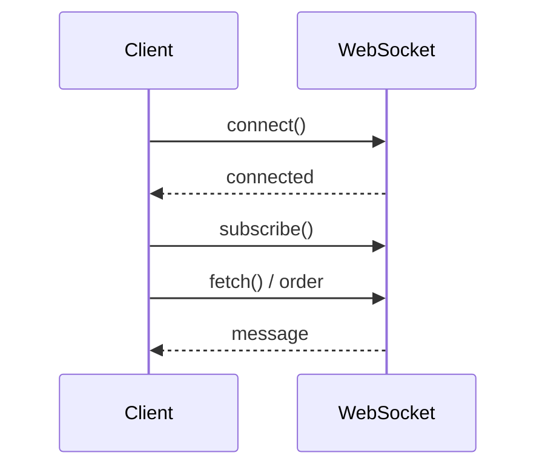

# 📚 웹소켓 트러블슈팅 가이드: Local vs EKS

EKS(클라우드) 환경에서 웹소켓 통신 시 발생했던 타이밍 이슈와 이에 대한 기술적 해결 방법을 정리한 문서입니다.

---

## 1. 웹소켓 연결 (Connection Timing) 차이

### 📍 현상
로컬 환경에서는 잘 돌아가던 코드가 EKS 환경에서는 **`InvalidStateError: The connection has not been established yet`**을 발생시킴.

### 🔍 원인 분석 (로컬 vs EKS)
*   **로컬(Localhost)**: 네트워크 지연이 거의 없어 `connect()` 호출 즉시 연결이 완료됨. 다음 줄의 `fetch()`나 `subscribe()`가 실행될 때 이미 연결된 상태임.
*   **EKS + NLB**: 물리적 거리와 로드밸런서(NLB) 통과 시간으로 인해 연결(`Handshake`)에 수십~수백 밀리초가 소요됨. 연결이 확립되기 전에 구독을 시도하여 에러 발생.

### ✅ 해결 방법
`Promise`를 사용하여 연결이 완료될 때까지 코드 실행을 명시적으로 대기(`await`)시킴.
```javascript
// 수정한 코드 예시
await new Promise((resolve, reject) => {
    stomp.connect({}, resolve, reject);
});
// 이제 안심하고 다음 로직 수행
```

---

## 2. 알림 구독 (Subscription Timing) 차이

### 📍 현상
주문 요청은 성공했으나, 알림 메시지가 화면에 나타나지 않고 무한 대기 상태에 빠짐 (메시지 유실).

### 🔍 원인 분석 (로컬 vs EKS)
*   **로컬**: 서버 처리 속도보다 클라이언트의 구독 설정이 우연히 빨라 메시지를 정상 수신함.
*   **EKS (High Speed Saga)**: 오케스트레이터와 카프카의 처리 속도가 매우 빠름. 브라우저가 주문 응답을 처리하고 구독을 시작하기 전에, 이미 서버는 알림 전송을 완료해버림 (Race Condition).

### ✅ 해결 방법
주문 요청(`fetch`)을 보내기 **전(Before)**에 미리 구독을 완료하여 대기 상태를 먼저 확보함.
*   **기존**: 주문 성공 응답 후 구독 (늦음)
*   **수정**: 웹소켓 연결 성공 직후 즉시 구독 시작 (안전)

---

## 3. 종합 비교 요약

| 비교 항목 | 로컬 환경 (Localhost) | EKS 환경 (NLB/Cloud) | 해결 전략 |
| :--- | :--- | :--- | :--- |
| **Network Latency** | 거의 0 (Instant) | 발생 (30ms ~ 200ms+) | **비동기 흐름 제어** |
| **Handshake 속도** | 매우 빠름 | 상대적으로 느림 | **Promise 대기** |
| **메시지 매칭** | 타이밍 이슈가 숨겨짐 | 타이밍 이슈가 즉각 노출됨 | **사전 구독 방식** |
| **로드밸런서 영향** | 없음 | NLB의 L4 패킷 전달 과정 포함 | 프로토콜 안정성 확보 |

---

## 💡 최종 심화 결론
클라우드 분산 환경에서는 네트워크 지연이 상존하므로, **"비동기 작업의 완료 순서"**를 시스템에 맡기지 않고 개발자가 코드로 직접 제어해야 합니다. 특히 웹소켓과 같은 유베럴(Stateful) 통신에서는 **"연결 -> 구독 -> 요청"**의 순서를 엄격히 준수하는 것이 MSA 시스템의 신뢰성을 결정짓는 핵심 요소입니다.

## Mermaid 다이어그램

### Flow


### Sequence



