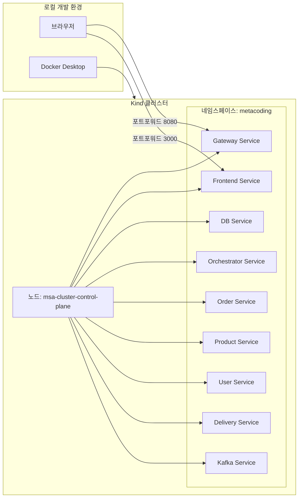
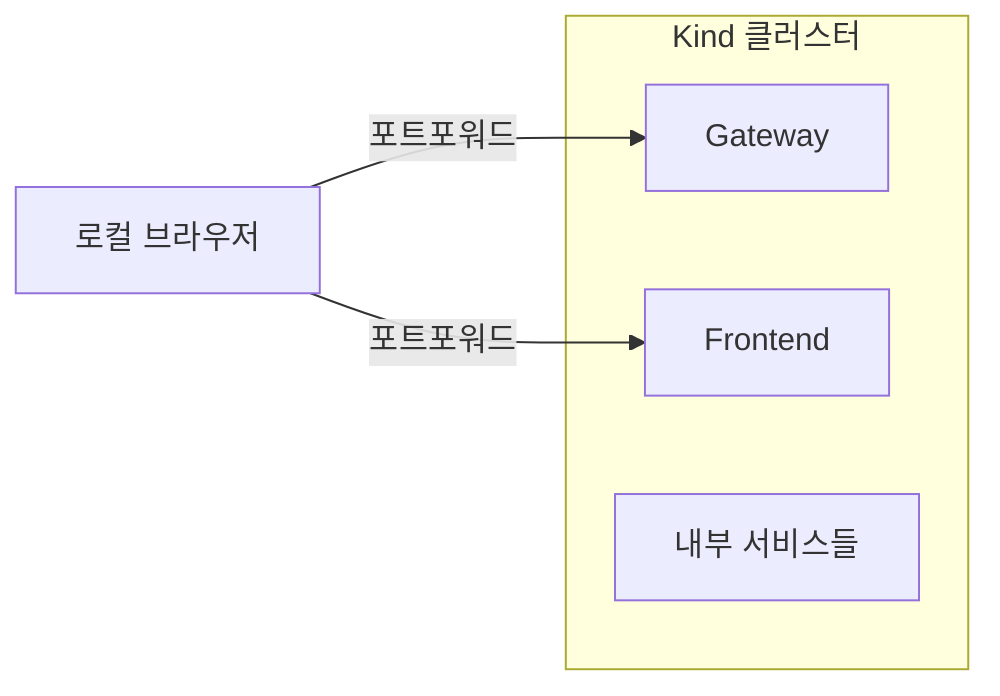

# Kind 배포 가이드 (상세 설명 포함)

이 프로젝트를 Kind(Kubernetes in Docker) 환경에서 배포하기 위한 단계별 가이드입니다. 각 명령어의 의미와 설명을 포함하고 있습니다.

## Kind 구성도 (Mermaid, LR)

### 0.1. 전체 구성도 (상세)



### 0.2. 요약 구성도 (간단)



## 1. 사전 준비 사항 (Prerequisites)

## 프론트 -> 게이트웨이 라우팅 설명

프론트엔드는 모든 백엔드 요청을 **게이트웨이로만** 보내고, 게이트웨이가 내부 서비스로 라우팅합니다.  
즉, **프론트는 여러 마이크로서비스의 주소를 몰라도** 되고, 게이트웨이가 단일 진입점 역할을 합니다.

### 왜 필요한가?

1. **단일 진입점 (Single Entry Point)**
   - 프론트는 `gateway` 주소만 알고 있으면 됩니다.
   - 서비스가 늘어나도 프론트 코드는 거의 바뀌지 않습니다.

2. **보안/인증 처리의 중앙화**
   - JWT 검사, 사용자 식별 등을 게이트웨이에서 한 번만 처리합니다.
   - 각 서비스에 인증 로직을 중복으로 넣지 않아도 됩니다.

3. **라우팅 규칙의 일관성**
   - `/api/orders`, `/api/users`, `/api/deliveries` 같은 규칙을 게이트웨이에서 관리합니다.
   - 프론트는 규칙에 맞춰 호출만 하면 됩니다.

4. **운영 편의성**
   - 서비스의 실제 주소가 바뀌어도 게이트웨이 설정만 바꾸면 됩니다.
   - 로깅/모니터링 포인트를 한 곳에 모을 수 있습니다.

### 이 프로젝트에서의 흐름

- **브라우저** → `frontend-service`
- **프론트(Nginx)** → `gateway-service`로 `/api/*` 요청 프록시
- **게이트웨이** → 각 마이크로서비스로 라우팅

예시:
```
브라우저 -> Frontend(/api/orders) -> Gateway(/api/orders) -> Order Service(/orders)
```

다음 도구들이 설치되어 있어야 합니다:
- [Docker Desktop](https://www.docker.com/products/docker-desktop/)
- [Kind](https://kind.sigs.k8s.io/docs/user/quick-start/#installation)
- [Kubectl](https://kubernetes.io/docs/tasks/tools/)

### 1.1. 설치 명령어 (OS별)

**macOS (Homebrew)**
```bash
brew install kind kubectl
```

**Linux (Ubuntu/Debian)**
```bash
# kubectl
curl -fsSL -o /usr/local/bin/kubectl \
  https://dl.k8s.io/release/$(curl -fsSL https://dl.k8s.io/release/stable.txt)/bin/linux/amd64/kubectl
chmod +x /usr/local/bin/kubectl

# kind
curl -fsSL -o /usr/local/bin/kind \
  https://kind.sigs.k8s.io/dl/v0.24.0/kind-linux-amd64
chmod +x /usr/local/bin/kind
```

**Windows**

*PowerShell + winget (권장)*
```powershell
winget install -e --id Kubernetes.kubectl
winget install -e --id Kubernetes.kind
```

*Chocolatey*
```powershell
choco install kubernetes-cli kind
```

> **명령어 상세 설명**:
> - macOS는 Homebrew로 `kind`, `kubectl`을 설치합니다.
> - Linux는 공식 바이너리를 내려받아 `/usr/local/bin`에 설치합니다.
> - Windows는 `winget` 또는 `choco`로 설치합니다. (Docker Desktop은 공식 사이트에서 설치)

### 1.2. 설치 확인 (버전 체크)
```bash
docker --version
kind --version
kubectl version --client
```

> **명령어 상세 설명**:
> - 각 도구가 정상 설치되었는지 버전 출력으로 확인합니다.

## 2. 클러스터 생성 (Create Cluster)

Kind 클러스터를 생성하고 상태를 확인합니다.

```bash
kind create cluster --name msa-cluster
kubectl cluster-info --context kind-msa-cluster
```

> **명령어 상세 설명**:
> - `kind create cluster --name msa-cluster`: 'msa-cluster'라는 이름으로 새로운 Kubernetes 클러스터를 생성합니다. Docker 컨테이너를 노드(가상 컴퓨터)로 사용하여 로컬에 클러스터를 구축합니다.
> - `kubectl cluster-info --context kind-msa-cluster`: 생성된 클러스터의 마스터 노드 주소와 CoreDNS 등 핵심 서비스가 잘 동작하는지 정보를 출력합니다. `--context`는 명령어를 실행할 대상을 명시합니다.

## 3. 네임스페이스 생성 (Create Namespace)

```bash
kubectl create namespace metacoding
```

> **명령어 상세 설명**:
> - `kubectl create namespace metacoding`: 'metacoding'이라는 이름의 네임스페이스(논리적 격리 공간)를 생성합니다. 모든 MSA 서비스들을 이 공간 안에 모아서 배포하고 관리하기 위함입니다. (마치 폴더 정리와 비슷합니다)

## 4. 이미지 빌드 및 로드 (Build & Load Images)

### 4.1. 이미지 빌드

프로젝트 루트 경로에서 실행하세요.

```bash
docker build -t metacoding/db:1 ./db
docker build -t metacoding/gateway:1 ./api-gateway
docker build -t metacoding/order:1 ./order
docker build -t metacoding/product:1 ./product
docker build -t metacoding/user:1 ./user
docker build -t metacoding/delivery:1 ./delivery
docker build -t metacoding/orchestrator:1 ./orchestrator
docker build -t metacoding/frontend:1 ./frontend
```

> **명령어 상세 설명**:
> - `docker build`: Docker 이미지를 생성하는 명령어입니다.
> - `-t metacoding/db:1`: 생성될 이미지에 태그(이름표)를 붙입니다. 이름은 `metacoding/db`, 버전은 `1`입니다.
> - `./db`: 이미지를 만들 때 참조할 Dockerfile과 소스 코드가 위치한 경로입니다.

### 4.2. 이미지를 Kind로 로드

**이 단계가 매우 중요합니다.** Kind는 로컬 컴퓨터의 이미지를 바로 볼 수 없으므로, 명시적으로 복사해 넣어야 합니다.

```bash
kind load docker-image metacoding/db:1 --name msa-cluster
kind load docker-image metacoding/gateway:1 --name msa-cluster
kind load docker-image metacoding/order:1 --name msa-cluster
kind load docker-image metacoding/product:1 --name msa-cluster
kind load docker-image metacoding/user:1 --name msa-cluster
kind load docker-image metacoding/delivery:1 --name msa-cluster
kind load docker-image metacoding/orchestrator:1 --name msa-cluster
kind load docker-image metacoding/frontend:1 --name msa-cluster
```

> **명령어 상세 설명**:
> - `kind load docker-image ...`: 로컬에 저장된 Docker 이미지를 Kind 클러스터 내부의 노드들로 전송합니다.
> - `--name msa-cluster`: 이미지를 어느 Kind 클러스터에 넣을지 지정합니다. 우리가 만든 클러스터 이름입니다.
> - **의미**: "내 컴퓨터에 있는 이미지를 가상의 클러스터 컴퓨터 안으로 복사해라"라는 뜻입니다. 안 하면 `ImagePullBackOff` 에러가 납니다.

## 5. Kubernetes 리소스 배포 (Deploy Resources)

### 5.1. Kafka 배포 (먼저 실행)

```bash
kubectl apply -f k8s/kafka

# Kafka Pod가 준비(Ready) 상태가 될 때까지 대기
kubectl wait --for=condition=ready pod -l app=kafka -n metacoding --timeout=300s
```

> **명령어 상세 설명**:
> - `kubectl apply -f k8s/kafka`: `k8s/kafka` 폴더 안에 있는 모든 설정 파일(YAML)을 읽어서 클러스터에 적용합니다. 즉, Kafka 서버를 띄웁니다.
> - `kubectl wait ...`: 특정 조건이 만족될 때까지 다음 명령어로 넘어가지 않고 기다립니다.
> - `--for=condition=ready`: Pod가 'Ready(준비 완료)' 상태가 될 때까지.
> - `pod -l app=kafka`: 라벨(Label)이 `app=kafka`인 Pod를 대상으로.
> - **의미**: "다른 서비스들이 Kafka를 쓰니까, Kafka가 완전히 켜질 때까지 최대 300초 동안 꼼짝 말고 기다려라."

### 5.2. 나머지 서비스 배포

```bash
kubectl apply -f k8s/db
kubectl apply -f k8s/gateway
kubectl apply -f k8s/order
kubectl apply -f k8s/product
kubectl apply -f k8s/user
kubectl apply -f k8s/delivery
kubectl apply -f k8s/orchestrator
kubectl apply -f k8s/frontend
```

> **명령어 상세 설명**:
> - `kubectl apply -f <폴더>`: 해당 폴더 내의 YAML 파일들에 정의된 대로 Deployment(실행 관리자)와 Service(네트워크 연결점)를 생성합니다.
> - **의미**: "이 폴더의 설계도대로 프로그램을 실행해라."

## 6. 서비스 접근 (Access Services)

```bash
# Frontend 연결 (새 터미널에서 실행)
kubectl port-forward service/frontend-service -n metacoding 3000:80
```

> **명령어 상세 설명**:
> - `kubectl port-forward`: 내 컴퓨터의 포트와 클러스터 내부의 포트를 연결(터널링)합니다.
> - `-n metacoding`: 해당 서비스가 있는 네임스페이스입니다.
> - `service/frontend-service`: 연결할 대상 서비스 이름입니다.
> - `3000:80`: 내 컴퓨터의 `3000`번 포트로 접속하면, 클러스터 내부 Frontend 서비스의 `80`번 포트로 연결해라.
> - **접속 주소**: [http://localhost:3000](http://localhost:3000)

### 6.1. 포트포워드 종료

포트포워드는 **실행 중인 터미널에서 `Ctrl+C`**를 누르면 종료됩니다.

터미널을 닫아서 프로세스가 남아있다면 아래로 종료하세요.

```bash
# 3000 포트포워드 종료
lsof -ti tcp:3000 | xargs kill -9
```

> **명령어 상세 설명**:
> - `lsof -ti tcp:<PORT>`: 해당 포트를 사용 중인 프로세스 ID(PID)만 출력합니다.
> - `xargs kill -9`: 출력된 PID를 강제 종료합니다.

## 7. 실습 순서 (Practice Flow)

아래 순서대로 진행하면 됩니다.

1. Postman으로 로그인 요청을 보내고 토큰을 발급받습니다.
2. 발급받은 토큰을 프론트엔드에 입력합니다.
3. Docker 이미지 빌드
4. Kind 클러스터로 이미지 로드
5. 주문 요청
6. 배달 조회
7. 배달 완료 요청

> **참고**:
> - 로그인/주문/배달 관련 API 경로는 `postman_collection.json`을 기준으로 사용하세요.
> - 프론트엔드 토큰 입력 위치는 UI에 있는 토큰 입력란(또는 로컬 스토리지/쿠키 사용 방식)을 따릅니다.

## 8. 상태 확인 & 정리

```bash
kubectl get pods -n metacoding
```
> - `get pods`: 현재 실행 중인 Pod(컨테이너)들의 목록과 상태(Running, Pending, Error 등)를 보여줍니다.

```bash
kind delete cluster --name msa-cluster
```
> - `delete cluster`: 만들었던 가상 클러스터를 완전히 삭제하여 시스템 자원을 정리합니다.

## 9. 트러블슈팅 (Troubleshooting)

### "failed while waiting for the kubelet to start" 에러 대처법

만약 클러스터 생성 중 아래와 같은 에러가 발생한다면, **Docker Desktop 재시작**이 가장 빠른 해결책입니다.

`error execution phase wait-control-plane: failed while waiting for the kubelet to start: ... connection refused`

**해결 방법:**

1.  **Docker Desktop 재시작**
    - 윈도우 작업 표시줄 우측 하단(System Tray)의 고래 아이콘 우클릭 -> **Quit Docker Desktop**.
    - 잠시 후 Docker Desktop을 다시 실행하세요. (이것만으로 90% 해결됩니다)

2.  **기존 클러스터 정리 후 재시도**
    Docker가 다시 켜지면 아래 명령어로 실패한 클러스터를 지우고 다시 만드세요.
    ```bash
    kind delete cluster --name msa-cluster
    kind create cluster --name msa-cluster
    ```

3.  **Docker 리소스 할당 확인**
    - Docker Desktop 설정(Settings) -> **Resources** 메뉴에서 `Memory`가 너무 적게(예: 2GB 미만) 설정되어 있지 않은지 확인하고, 최소 4GB 이상으로 늘려주세요.
