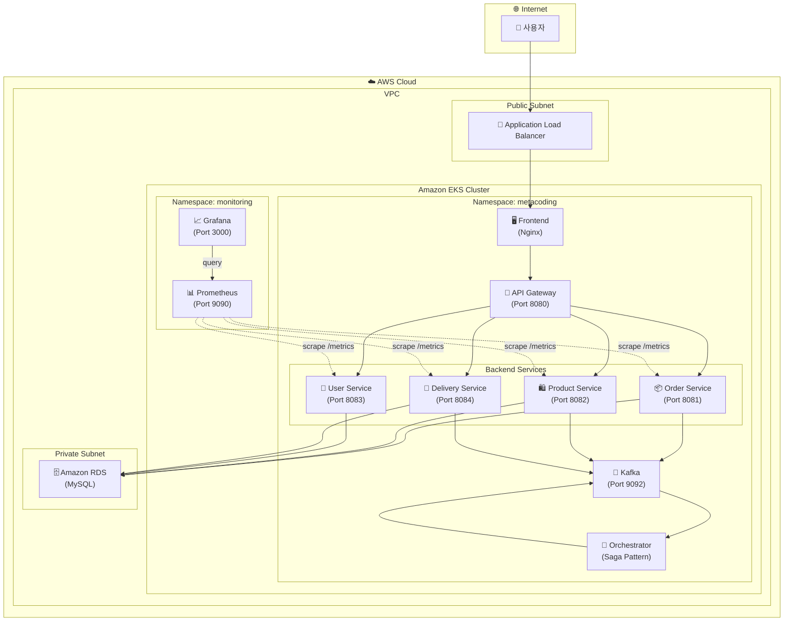
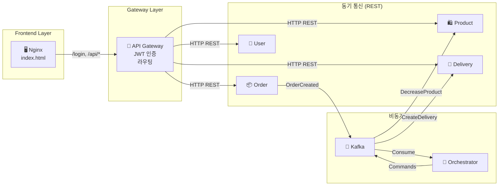
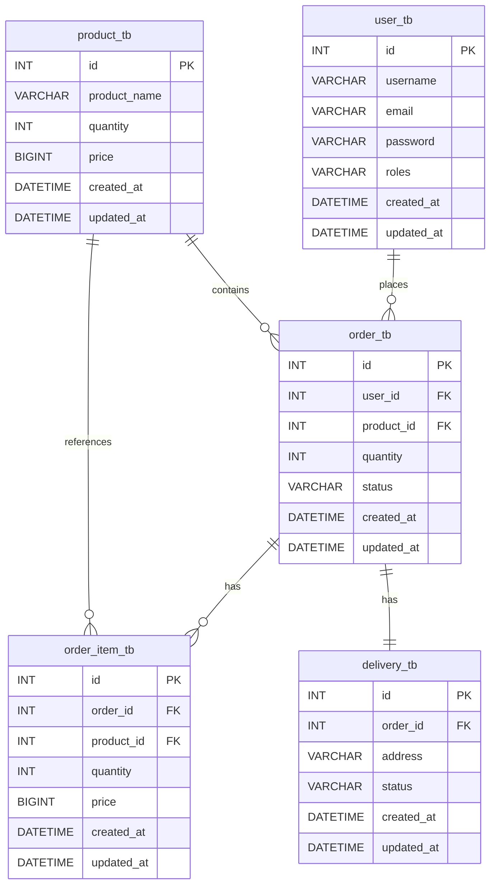
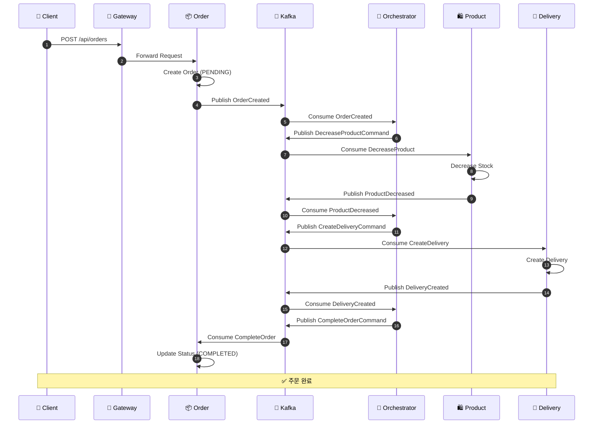
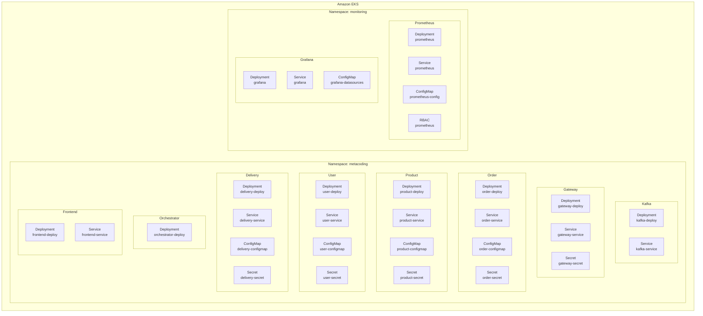
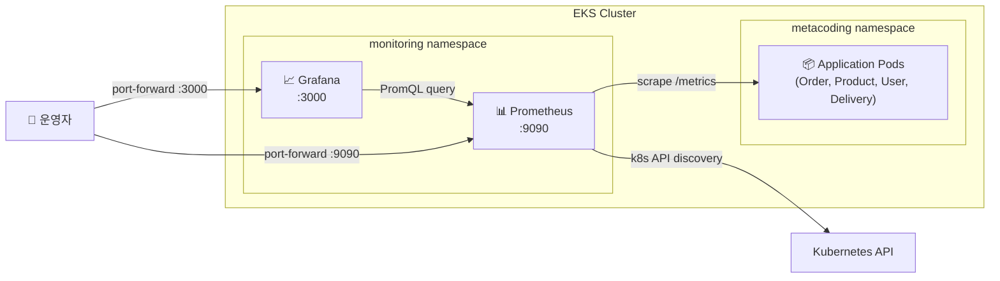
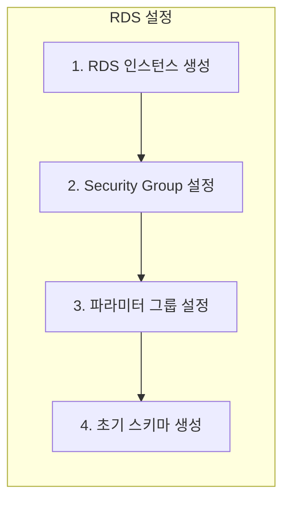

# EKS 배포를 위한 MSA 프로젝트 아키텍처 분석

## 📋 프로젝트 개요

이 프로젝트는 **마이크로서비스 아키텍처(MSA)** 기반의 이커머스 주문 시스템입니다.

| 구성 요소 | 기술 스택 |
|-----------|-----------|
| **언어** | Java 21 |
| **프레임워크** | Spring Boot 3.2.9 |
| **메시지 브로커** | Apache Kafka (KRaft 모드) |
| **데이터베이스** | MySQL (RDS 배포 예정) |
| **프론트엔드** | Nginx + Static HTML |
| **컨테이너** | Docker |
| **오케스트레이션** | Kubernetes (EKS) |

---

## 🏗️ 전체 시스템 아키텍처



---

## 🔄 서비스 통신 아키텍처



---

## 📊 데이터베이스 스키마 (RDS)



---

## 🎭 Saga 패턴 - 주문 처리 흐름



---

## 🐳 마이크로서비스 상세

### 서비스 목록

| 서비스 | 포트 | 설명 | 주요 기능 |
|--------|------|------|-----------|
| **api-gateway** | 8080 | API 게이트웨이 | JWT 인증, 라우팅, WebSocket |
| **order** | 8081 | 주문 서비스 | 주문 생성/조회/취소 |
| **product** | 8082 | 상품 서비스 | 상품 관리, 재고 관리 |
| **user** | 8083 | 사용자 서비스 | 회원가입, 로그인, 인증 |
| **delivery** | 8084 | 배송 서비스 | 배송 생성/추적 |
| **orchestrator** | - | 오케스트레이터 | Saga 패턴 조정자 |
| **frontend** | 80 | 프론트엔드 | Nginx + Static Files |

---

## ☸️ Kubernetes 리소스 구조



---

## 📊 모니터링 아키텍처



---

## 🚀 EKS 배포 가이드

### 1️⃣ 사전 준비

#### AWS CLI & kubectl 설정
```bash
# AWS CLI 설치 확인
aws --version

# kubectl 설치 확인
kubectl version --client

# eksctl 설치 확인
eksctl version
```

#### AWS 자격 증명 설정
```bash
aws configure
# AWS Access Key ID: [your-access-key]
# AWS Secret Access Key: [your-secret-key]
# Default region name: ap-northeast-2
# Default output format: json
```

---

### 2️⃣ Amazon RDS (MySQL) 설정



#### RDS 인스턴스 생성
```bash
# RDS MySQL 인스턴스 생성
aws rds create-db-instance \
    --db-instance-identifier metacoding-db \
    --db-instance-class db.t3.micro \
    --engine mysql \
    --engine-version 8.0 \
    --master-username admin \
    --master-user-password <your-password> \
    --allocated-storage 20 \
    --vpc-security-group-ids <security-group-id> \
    --db-subnet-group-name <subnet-group-name> \
    --no-publicly-accessible
```

#### 초기 데이터베이스 스키마 적용
```sql
-- db/init.sql 파일의 내용을 RDS에 적용
CREATE TABLE user_tb (
  id INT AUTO_INCREMENT PRIMARY KEY,
  username VARCHAR(50),
  email VARCHAR(50),
  password VARCHAR(50),
  roles VARCHAR(50),
  created_at DATETIME,
  updated_at DATETIME
);

CREATE TABLE product_tb (
  id INT AUTO_INCREMENT PRIMARY KEY,
  product_name VARCHAR(50),
  quantity INT,
  price BIGINT,
  created_at DATETIME,
  updated_at DATETIME
);

CREATE TABLE order_tb (
  id INT AUTO_INCREMENT PRIMARY KEY,
  user_id INT,
  product_id INT,
  quantity INT,
  status VARCHAR(50),
  created_at DATETIME,
  updated_at DATETIME
);

CREATE TABLE order_item_tb (
  id INT AUTO_INCREMENT PRIMARY KEY,
  order_id INT,
  product_id INT,
  quantity INT,
  price BIGINT,
  created_at DATETIME,
  updated_at DATETIME
);

CREATE TABLE delivery_tb (
  id INT AUTO_INCREMENT PRIMARY KEY,
  order_id INT,
  address VARCHAR(50),
  status VARCHAR(50),
  created_at DATETIME,
  updated_at DATETIME
);
```

---

### 3️⃣ Amazon ECR 설정

```bash
# ECR 리포지토리 생성
aws ecr create-repository --repository-name metacoding/gateway
aws ecr create-repository --repository-name metacoding/order
aws ecr create-repository --repository-name metacoding/product
aws ecr create-repository --repository-name metacoding/user
aws ecr create-repository --repository-name metacoding/delivery
aws ecr create-repository --repository-name metacoding/orchestrator
aws ecr create-repository --repository-name metacoding/frontend

# ECR 로그인
aws ecr get-login-password --region ap-northeast-2 | docker login --username AWS --password-stdin <account-id>.dkr.ecr.ap-northeast-2.amazonaws.com
```

---

### 4️⃣ Docker 이미지 빌드 및 Push

```bash
# 프로젝트 루트 디렉토리에서 실행
ECR_URI=<account-id>.dkr.ecr.ap-northeast-2.amazonaws.com

# 각 서비스 빌드 및 Push
docker build -t $ECR_URI/metacoding/gateway:1 ./api-gateway
docker push $ECR_URI/metacoding/gateway:1

docker build -t $ECR_URI/metacoding/order:1 ./order
docker push $ECR_URI/metacoding/order:1

docker build -t $ECR_URI/metacoding/product:1 ./product
docker push $ECR_URI/metacoding/product:1

docker build -t $ECR_URI/metacoding/user:1 ./user
docker push $ECR_URI/metacoding/user:1

docker build -t $ECR_URI/metacoding/delivery:1 ./delivery
docker push $ECR_URI/metacoding/delivery:1

docker build -t $ECR_URI/metacoding/orchestrator:1 ./orchestrator
docker push $ECR_URI/metacoding/orchestrator:1

docker build -t $ECR_URI/metacoding/frontend:1 ./frontend
docker push $ECR_URI/metacoding/frontend:1
```

---

### 5️⃣ EKS 클러스터 생성

```bash
# EKS 클러스터 생성
eksctl create cluster \
    --name metacoding-cluster \
    --region ap-northeast-2 \
    --version 1.28 \
    --nodegroup-name standard-workers \
    --node-type t3.medium \
    --nodes 3 \
    --nodes-min 2 \
    --nodes-max 4 \
    --managed

# kubeconfig 업데이트
aws eks update-kubeconfig --name metacoding-cluster --region ap-northeast-2

# 클러스터 확인
kubectl get nodes
```

---

### 6️⃣ K8s 매니페스트 수정 (RDS 연결)

#### ConfigMap 수정 예시 (order-configmap.yml)
```yaml
apiVersion: v1
kind: ConfigMap
metadata:
  name: order-configmap
  namespace: metacoding
data:
  DB_URL: "jdbc:mysql://<rds-endpoint>:3306/metacoding"
  DB_DRIVER: "com.mysql.cj.jdbc.Driver"
  DDL_AUTO: "validate"
  SPRING_KAFKA_BOOTSTRAP_SERVERS: "kafka-service:9092"
```

#### Secret 수정 예시 (order-secret.yml)
```yaml
apiVersion: v1
kind: Secret
metadata:
  name: order-secret
  namespace: metacoding
type: Opaque
data:
  DB_USERNAME: <base64-encoded-username>
  DB_PASSWORD: <base64-encoded-password>
```

#### Deployment 이미지 경로 수정 예시
```yaml
spec:
  containers:
    - name: order-server
      image: <account-id>.dkr.ecr.ap-northeast-2.amazonaws.com/metacoding/order:1
```

---

### 7️⃣ Kubernetes 리소스 배포

```bash
# 네임스페이스 생성
kubectl create namespace metacoding

# Kafka 먼저 배포
kubectl apply -f k8s/kafka

# Kafka 준비 대기
kubectl wait --for=condition=ready pod -l app=kafka -n metacoding --timeout=120s

# 서비스 배포
kubectl apply -f k8s/gateway
kubectl apply -f k8s/order
kubectl apply -f k8s/product
kubectl apply -f k8s/user
kubectl apply -f k8s/delivery
kubectl apply -f k8s/orchestrator
kubectl apply -f k8s/frontend

# 배포 상태 확인
kubectl get pods -n metacoding
kubectl get services -n metacoding
```

---

## 📁 프로젝트 디렉토리 구조

```
ex04/
├── 📄 README.md                    # 프로젝트 README
├── 📂 api-gateway/                 # API Gateway 서비스
│   ├── Dockerfile
│   ├── build.gradle
│   └── src/main/java/com/metacoding/gateway/
│       ├── GatewayApplication.java
│       ├── controller/GatewayController.java
│       └── service/GatewayService.java
├── 📂 order/                       # 주문 서비스
│   ├── Dockerfile
│   ├── build.gradle
│   └── src/main/java/com/metacoding/order/
│       ├── OrderApplication.java
│       ├── repository/
│       ├── usecase/
│       └── web/OrderController.java
├── 📂 product/                     # 상품 서비스
│   ├── Dockerfile
│   ├── build.gradle
│   └── src/...
├── 📂 user/                        # 사용자 서비스
│   ├── Dockerfile
│   ├── build.gradle
│   └── src/...
├── 📂 delivery/                    # 배송 서비스
│   ├── Dockerfile
│   ├── build.gradle
│   └── src/...
├── 📂 orchestrator/                # Saga Orchestrator
│   ├── Dockerfile
│   ├── build.gradle
│   └── src/main/java/com/metacoding/orchestrator/
│       ├── OrchestratorApplication.java
│       ├── handler/OrderOrchestrator.java
│       └── message/  # Kafka 메시지 정의
├── 📂 frontend/                    # 프론트엔드 (Nginx)
│   ├── Dockerfile
│   ├── index.html
│   └── nginx.conf
├── 📂 db/                          # 데이터베이스 초기화
│   ├── Dockerfile
│   └── init.sql
└── 📂 k8s/                         # Kubernetes 매니페스트
    ├── kafka/
    ├── gateway/
    ├── order/
    ├── product/
    ├── user/
    ├── delivery/
    ├── orchestrator/
    └── frontend/
```

---

## ⚠️ RDS 마이그레이션 시 주요 변경 사항

> [!IMPORTANT]
> 기존 `k8s/db/` 디렉토리의 MySQL 컨테이너 배포 대신 Amazon RDS를 사용합니다.

### 변경이 필요한 파일들:

1. **ConfigMap 파일들** - DB_URL을 RDS 엔드포인트로 변경
   - `k8s/order/order-configmap.yml`
   - `k8s/product/product-configmap.yml`
   - `k8s/user/user-configmap.yml`
   - `k8s/delivery/delivery-configmap.yml`

2. **Secret 파일들** - RDS 자격 증명으로 변경
   - `k8s/order/order-secret.yml`
   - `k8s/product/product-secret.yml`
   - `k8s/user/user-secret.yml`
   - `k8s/delivery/delivery-secret.yml`

3. **Deployment 파일들** - ECR 이미지 경로로 변경
   - 모든 `*-deploy.yml` 파일

4. **삭제 대상**
   - `k8s/db/` 디렉토리 전체 (RDS 사용으로 불필요)

---

## 🔒 보안 권장 사항

> [!CAUTION]
> 프로덕션 배포 전 반드시 다음 사항을 확인하세요.

1. **JWT Secret** - 환경 변수 또는 AWS Secrets Manager 사용
2. **RDS 비밀번호** - AWS Secrets Manager 또는 Parameter Store 사용
3. **Security Group** - 최소 권한 원칙 적용
4. **Network Policy** - Pod 간 통신 제한
5. **RBAC** - 서비스 계정 권한 최소화
