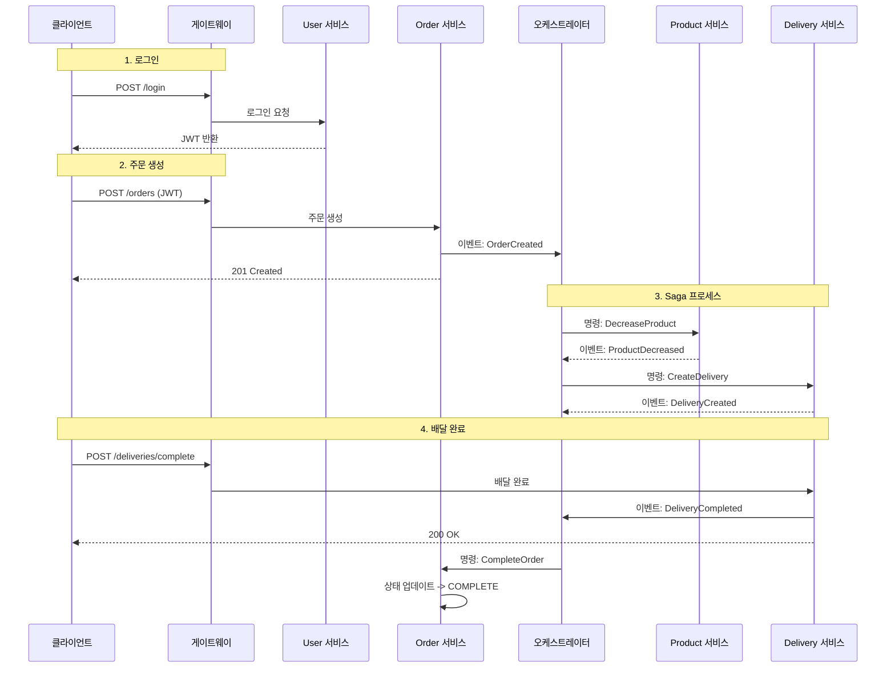

# 사용 시나리오: 로그인 -> 주문 -> 배달완료

이 문서는 로그인부터 주문 생성, 그리고 배달 완료까지의 전체 사용자 여정을 설명합니다. 이 흐름은 **동기식(HTTP)** 및 **비동기식(Kafka/Saga)** 통신을 모두 포함합니다.

## 1. 로그인 (동기식)

*   **목표**: 사용자 인증 및 JWT 토큰 발급.
*   **흐름**:
    1.  **클라이언트**가 `POST /login` 요청을 계정 정보와 함께 보냅니다.
    2.  **NLB** -> **프론트엔드** -> **게이트웨이** 순으로 전달됩니다.
    3.  **게이트웨이**가 **User 서비스**로 라우팅합니다.
    4.  **User 서비스**가 **RDS(User DB)**를 통해 비밀번호를 검증합니다.
    5.  **User 서비스**가 **JWT**를 생성하여 반환합니다.
    6.  **클라이언트**는 이후 요청을 위해 JWT를 저장합니다.

## 2. 주문 생성 (동기식 + 비동기식)

*   **목표**: 주문을 생성하고 배송 프로세스를 트리거합니다.
*   **흐름**:
    1.  **클라이언트**가 `POST /api/orders` 요청을 보냅니다 (JWT 헤더 포함).
    2.  **NLB** -> **프론트엔드** -> **게이트웨이** 순으로 전달됩니다.
    3.  **게이트웨이**가 JWT를 검증하고 **Order 서비스**로 라우팅합니다.
    4.  **Order 서비스**:
        *   **RDS(Order DB)**에 주문을 `PENDING(대기)` 상태로 저장합니다.
        *   `OrderCreated` 이벤트를 **Kafka**에 발행합니다.
        *   클라이언트에게 즉시 "주문 생성됨" 응답을 반환합니다.

## 3. 주문 처리 및 배달 생성 (비동기식 Saga 패턴)

*   **목표**: 오케스트레이터가 재고 차감과 배달 생성을 조율합니다.
*   **흐름 (오케스트레이터)**:
    1.  **Orchestrator 서비스**가 `OrderCreated` 이벤트를 소비(Consume)합니다.
    2.  **Orchestrator**가 `DecreaseProductCommand`(상품 차감 명령)를 Kafka에 발행합니다.
    3.  **Product 서비스**:
        *   명령을 소비합니다.
        *   **RDS(Product DB)**의 재고를 업데이트합니다.
        *   `ProductDecreased` 이벤트(성공/실패)를 발행합니다.
    4.  **Orchestrator**가 `ProductDecreased`를 소비합니다.
        *   성공 시: `CreateDeliveryCommand`(배달 생성 명령)를 Kafka에 발행합니다.
    5.  **Delivery 서비스**:
        *   명령을 소비합니다.
        *   **RDS(Delivery DB)**에 배달 기록을 `PENDING` 상태로 생성합니다.
        *   `DeliveryCreated` 이벤트를 발행합니다.
    6.  **Orchestrator**가 `DeliveryCreated`를 소비합니다.
        *   워크플로우 상태를 업데이트하고 배달 완료를 기다립니다.

## 4. 배달 완료 (동기식 + 비동기식)

*   **목표**: 기사가 배달을 완료하고, 최종적으로 주문 상태를 완료로 변경합니다.
*   **흐름**:
    1.  **클라이언트(기사)**가 `PUT /api/deliveries/{id}/complete` 요청을 보냅니다.
    2.  **Delivery 서비스**:
        *   **RDS(Delivery DB)**의 상태를 `COMPLETE`로 업데이트합니다.
        *   `DeliveryCompleted` 이벤트를 **Kafka**에 발행합니다.
        *   클라이언트에게 성공 응답을 반환합니다.
    3.  **Orchestrator**가 `DeliveryCompleted`를 소비합니다.
        *   `CompleteOrderCommand`(주문 완료 명령)를 Kafka에 발행합니다.
    4.  **Order 서비스**:
        *   명령을 소비합니다.
        *   **RDS(Order DB)**의 주문 상태를 `COMPLETE`로 업데이트합니다.

## 시각적 요약

